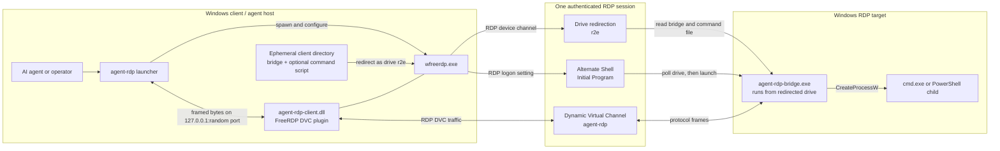
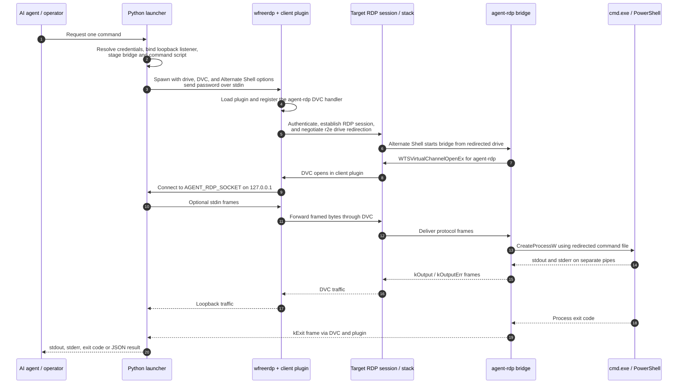

# agent-rdp

[](https://github.com/Hubert-Rybak/agent-rdp/actions/workflows/ci.yml)

A Windows-to-Windows fork of [blacknon/rdp2exec](https://github.com/blacknon/rdp2exec), retargeted so an AI agent (or any script) running on a **Windows** host can execute `cmd`/PowerShell commands on a remote **Windows** RDP target — without opening any extra management port, and **without ever writing a file to the target's local disk**.

## What changed vs. upstream rdp2exec

Upstream `rdp2exec` is a Linux client (FreeRDP/`xfreerdp` + `xdotool`/X11) driving a Windows RDP target. This fork retargets the client side to Windows and removes the GUI-automation bootstrap entirely:

| | Upstream (Linux → Windows) | This fork (Windows → Windows) |
|---|---|---|
| Client | `xfreerdp` on Linux, X11 + `xdotool` | `wfreerdp.exe` (FreeRDP's native Windows client) |
| Bootstrap | Simulates `Win+R`, types a command into the visible Run dialog | RDP's native **Alternate Shell** (`/shell:`, `/shell-dir:`) — no GUI automation, no visible desktop interaction, works headlessly |
| Remote persistence | Copies the helper `.exe` to the target's `%TEMP%`, runs it, deletes it | Helper `.exe` runs **directly off the client-redirected drive** (`\\tsclient\...`); nothing is ever written to the target's local disk |
| Local IPC (client ↔ plugin) | Unix domain socket | TCP loopback socket (Windows has no `AF_UNIX` here) |
| Command output | Always via ConPTY (terminal control sequences mixed into output) | Interactive shell still uses ConPTY; single-command mode uses plain pipes with **separate stdout/stderr and exit code** — easy for a program to parse |

The Windows target-side bridge (`agent-rdp-bridge.exe`) was already native Windows C++ in upstream and needed no port — only a new non-PTY execution mode was added to it.

## Requirements

- A Windows host to run the client (`agent-rdp`) from.
- A Windows target with RDP enabled and a user account you can authenticate as.

Building from source has its own toolchain requirements — see [Build](#build).

## Install

This is not a pure-Python tool: the launcher drives three native binaries — `wfreerdp.exe` (FreeRDP's Windows client) plus this repo's own `agent-rdp-client.dll` and `agent-rdp-bridge.exe`, both compiled from C++. Until the first complete release asset is published, [build the complete application from source](#build).

### Pre-built release (pending)

The `v0.1.0` GitHub release record currently has no downloadable application assets, so it is **not an installation method yet**. Publication of the complete ZIP is pending the corrected release workflow reaching the default branch and being run. Do not use the automatically generated source archives: they do not contain the built native binaries.

Every semantic-version tag push (`v<major>.<minor>.<patch>`) triggers [`.github/workflows/release.yml`](.github/workflows/release.yml). Maintainers can also run that workflow manually; it builds `agent-rdp-client.dll` and `agent-rdp-bridge.exe`, bundles `wfreerdp.exe` and its runtime DLLs, freezes the launcher into `agent-rdp.exe`, and publishes the complete ZIP and SHA-256 checksum. A manual run repairs an existing asset-less release such as `v0.1.0`, or creates a new release from the default branch when its tag does not exist.

Once a release lists both `agent-rdp-v<version>-x64.zip` and `agent-rdp-v<version>-x64.zip.sha256.txt`, download both, verify the ZIP, extract it, and add the extracted directory to `PATH`. The ZIP must contain `agent-rdp.exe`, `agent-rdp-client.dll`, `agent-rdp-bridge.exe`, `wfreerdp.exe`, and the required runtime DLLs.

### From source

See [Build](#build).

## Usage

> These examples use `agent-rdp` for readability. With the currently available complete source build, use `python src/launcher/agent_rdp.py` in its place — same arguments and behavior.

```powershell
# Login shell: PowerShell (default)
agent-rdp user@hostname

# Login shell: CMD
agent-rdp user@hostname cmd

# Single command, clean separated stdout/stderr + exit code -- the mode an AI agent should use
agent-rdp user@hostname powershell Get-Process

agent-rdp user@hostname cmd ipconfig /all

# Compatibility override only: explicitly bypass the target's PowerShell execution policy
agent-rdp --powershell-execution-policy bypass user@hostname powershell Get-Process

# Non-default port
agent-rdp -p 3390 user@hostname

# Insecure compatibility override for a known, authorized host with an untrusted certificate
agent-rdp --insecure-cert-ignore user@hostname cmd whoami

# Password via argument (or set RDP_PASSWORD)
agent-rdp -P 'secret' user@hostname powershell

# Structured JSON result (single object) -- easiest for a tool layer to parse
agent-rdp --json user@hostname powershell Get-Service Spooler

# Fan one command out across several targets, in parallel (JSON array result)
agent-rdp user@h1,user@h2,user@h3 cmd hostname

# Unattended: read the password from a stored Windows Credential Manager entry
agent-rdp --credential-target my-rdp-box user@hostname cmd whoami
```

`command...` triggers single-command mode (non-interactive, plain-pipe I/O). Omit it to get an interactive ConPTY-backed shell.

One-shot PowerShell commands respect the target's configured execution policy by default. If an authorized environment requires an explicit policy, place `--powershell-execution-policy {allsigned,remotesigned,restricted,unrestricted,bypass}` before the target. `bypass` is never implicit: it can increase antivirus/EDR scrutiny and should only be used when the target's administrator has approved that compatibility override.

RDP server certificate validation is also enabled by default. `--insecure-cert-ignore` (legacy alias: `--cert-ignore`) is an explicit compatibility override for known authorized targets with certificates that cannot yet be trusted; it emits a warning and must not be used as the production default.

### Using this as an AI agent tool

For programmatic/agent use, invoke with a single command and no interactive shell:

```powershell
agent-rdp user@host powershell Get-Service -Name Spooler
```

- stdout and stderr arrive as separate byte streams (no ANSI/terminal control sequences mixed in, since single-command mode bypasses ConPTY).
- The process's exit code is the remote command's exit code.
- Wrap this invocation as a tool call that shells out to it, captures stdout/stderr, and returns them structured — or just use `--json` (below) and parse one object.

#### `--json`: one structured object

`--json` (single-command mode only) buffers the run and prints a single JSON object instead of streaming raw bytes:

```json
{"target": "user@host", "exit_code": 0, "stdout": "...", "stderr": "...", "error": null, "error_detail": null}
```

- `exit_code` is the remote command's exit code (the process also exits with it; when an `error` is set but no exit code was reported, the process exits non-zero).
- `error` is `null` on success, or one of the stable slugs below; `error_detail` carries the original bridge text/number for humans.
- Note: `--json` holds the full output in memory — intended for command results, not for arbitrarily large streams.

#### Stable error vocabulary

Rather than making an agent branch on raw bridge text or numeric codes, `error` uses a small closed set (`error_detail` preserves the original):

| `error` slug | Meaning |
|---|---|
| `conpty_unavailable` | The target couldn't create a pseudo console (ConPTY missing/failed). |
| `pipe_setup_failed` | A stdin/stdout/stderr pipe couldn't be created on the target. |
| `process_setup_failed` | Process/attribute-list setup failed before spawning the command. |
| `process_spawn_failed` | `CreateProcessW` for the command itself failed on the target. |
| `remote_error` | Some other remote error (see `error_detail`). |
| `connect_timeout` | The remote bridge never connected back within `--accept-timeout`. |
| `channel_dropped` | The channel closed before an exit code was reported. |
| `local_setup_error` | A local prerequisite (plugin DLL / bridge exe) was missing. |
| `auth_required` | No password could be resolved for an unattended run. |

#### Multiple targets

Pass a comma-separated list as the target (`user@h1,user@h2`) or `--targets-file <path>` (one `user@host` per line, `#` comments allowed) to run the same command across many hosts in parallel. Multi-target mode requires a command (no interactive shell), runs up to `--max-parallel` (default 4) at once — each with its own isolated session — and always prints a **JSON array** of the per-target result objects (in input order). The process exits `0` only if every target succeeded.

#### Credentials for unattended use

Beyond `-P`/`RDP_PASSWORD`/interactive prompt, the password can come from the **Windows Credential Manager**:

```powershell
# Store once (uses the target username), then run unattended later with no -P:
agent-rdp --credential-target my-rdp-box --save-credential -P 'secret' user@host cmd whoami
agent-rdp --credential-target my-rdp-box user@host cmd whoami
```

Resolution order: `-P/--password` → `RDP_PASSWORD` → `--credential-target` (Credential Manager) → interactive prompt.

## Architecture

### How remote execution is carried over RDP

The target-facing connection is an ordinary authenticated RDP session. `agent-rdp` does **not** open a second management connection and does not require WinRM, SSH, SMB, or a custom inbound port on the target. Instead, it combines three standard RDP capabilities inside that session:

1. **Drive redirection** exposes an ephemeral client-side directory to the target as the `r2e` redirected drive (`\\tsclient\r2e`). The bridge executable and optional command script remain on the client and are read across this virtual filesystem channel.
2. **Alternate Shell / Initial Program** asks the RDP session to run a short bootstrap command instead of Explorer. The bootstrap waits for drive redirection to become ready and starts the bridge directly from the redirected UNC path.
3. **Dynamic Virtual Channel (DVC)** named `agent-rdp` carries framed stdin, stdout, stderr, resize, error, and exit-code messages between the target bridge and the client plugin.

The TCP socket shown below is strictly client-local (`127.0.0.1` on the agent host). It connects the Python launcher to the FreeRDP plugin inside `wfreerdp.exe`; it is not reachable from the target or the network. The target-side bridge communicates only through the DVC already multiplexed into RDP.



| Path | Scope | Purpose |
|---|---|---|
| RDP transport | Client ↔ target | Authentication, encryption, session setup, and multiplexing of the standard RDP virtual channels. |
| Redirected `r2e` drive | Inside RDP | Makes the client-side bridge and command script readable as `\\tsclient\r2e\...`; this is RDP device redirection, not a network SMB share. |
| Alternate Shell | Target RDP session | Starts the bridge headlessly after logon, without Run-dialog automation or a visible desktop. |
| `agent-rdp` DVC | Inside RDP | Bidirectional framed command I/O and lifecycle messages. |
| Ephemeral loopback TCP | Client only | Connects the launcher process to the plugin loaded inside `wfreerdp.exe`; never crosses the network. |

1. **Launcher** (`src/launcher/agent_rdp.py`) spawns `wfreerdp.exe` with device redirection (`/drive:`) pointing at a local temp directory containing the bridge executable (and, for single-command mode, a small generated `.ps1`/`.cmd` script), a Dynamic Virtual Channel (`/dvc:agent-rdp`), and an **Alternate Shell** command line (`/shell:`) that waits for the redirected drive to mount and then runs the bridge straight off it.
2. **FreeRDP client plugin** (`src/plugin/agent_rdp_client.cpp`, built as `agent-rdp-client.dll`) registers as the client handler for the `agent-rdp` DVC and relays bytes to/from a TCP loopback socket the launcher listens on. The target bridge initiates the channel open from inside the RDP session.
3. **Windows bridge** (`src/windows/agent_rdp_bridge.cpp`) runs on the target, opens the DVC server-side (`WTSVirtualChannelOpenEx`), and either:
   - creates a ConPTY-backed interactive shell (no `--command-file`), or
   - runs a single command through plain stdin/stdout/stderr pipes (`--command-file` given), streaming stdout and stderr back as **separate** frames plus a final exit-code frame — the mode used for agent/single-command invocations.

### Zero remote disk writes

The only thing that ever touches the target host's local filesystem is whatever the *command you run* does. The tool itself does not:
- copy the bridge executable to the target (it runs directly from the FreeRDP-redirected `\\tsclient\...` UNC path),
- write any wrapper `.bat`/`.cmd` file to the target (the retry/bootstrap logic is passed inline via `/shell:`, not staged as a file),
- leave the per-command PowerShell/CMD script on the target (it's likewise read straight from the redirected drive).

Everything staged for a session lives in an ephemeral temp directory on the **client** (the machine running `agent_rdp.py`), for the lifetime of that RDP connection.

### End-to-end walkthrough

What actually happens between typing `agent-rdp user@host cmd whoami` and getting output back:



The diagram shows the single-command path used by agents. Interactive sessions use the same setup and transport, but the bridge creates a ConPTY instead of three plain pipes and the launcher continuously exchanges input and resize frames.

1. **Resolve and validate (client).** The launcher parses the target(s), resolves the password (`-P` → `RDP_PASSWORD` → Credential Manager → interactive prompt), and confirms the two local binaries it needs exist: the FreeRDP plugin (`agent-rdp-client.dll`) and the bridge exe (`agent-rdp-bridge.exe`). Anything missing here fails fast as `local_setup_error` before a connection is attempted.
2. **Open a loopback listener (client).** `LoopbackSocketServer` binds `127.0.0.1:0` — the OS picks a free port — and starts listening for exactly one connection. The chosen `host:port` is exported as the `AGENT_RDP_SOCKET` environment variable, which is how the plugin (below) will find its way back to this launcher instance. A random OS-assigned port per run is what makes concurrent multi-target sessions safe — no two collide.
3. **Stage the payload into a redirected drive (client).** The bridge exe is copied into an ephemeral client-side temp dir, and — in single-command mode — a small `.ps1` or `.cmd` script wrapping your command is written next to it. That temp dir is handed to `wfreerdp.exe` as a redirected drive (`/drive:r2e,<tempdir>`), so the target will see its contents at `\\tsclient\r2e\...`. These files live on the **client's** disk; the target only ever reads them across the RDP device-redirection channel.
4. **Launch the RDP client with an Alternate Shell (client).** `wfreerdp.exe` is spawned with the target/credentials, the redirected drive, a Dynamic Virtual Channel registration (`/dvc:agent-rdp`), and an **Alternate Shell** command line (`/shell:` + `/shell-dir:`). The password is fed to `wfreerdp` over stdin (`/from-stdin:force`) rather than the command line. See [Bootstrapping without GUI automation](#bootstrapping-without-gui-automation) for what that shell command actually does.
5. **Session logon runs the bridge (target).** On logon, RDP runs the Alternate Shell command instead of the normal desktop shell. That command polls for the redirected drive to mount, then executes `agent-rdp-bridge.exe` straight off `\\tsclient\r2e\` — no copy to local disk.
6. **The bridge opens the channel from the inside (target).** The bridge calls `WTSVirtualChannelOpenEx(WTS_CURRENT_SESSION, "agent-rdp", …DYNAMIC)` to open the server end of the `agent-rdp` DVC from within the RDP session.
7. **The plugin bridges DVC ↔ loopback (client).** Inside `wfreerdp.exe`, FreeRDP loads `agent-rdp-client.dll` as the handler for the `agent-rdp` DVC. When the channel opens, the plugin reads `AGENT_RDP_SOCKET`, connects a TCP socket back to the launcher's loopback listener (retrying while the connection is refused), and from then on shuttles raw bytes both ways: DVC → socket, and socket → DVC.
8. **The launcher accepts the connection (client).** `server.accept(timeout=--accept-timeout)` (default 60s) unblocks the moment the plugin connects. Now there is a continuous byte pipe: **launcher ⇄ loopback socket ⇄ plugin ⇄ DVC ⇄ bridge**. Everything above this point was setup; everything below is framed protocol over that pipe.
9. **Run and stream (both ends).** The bridge spawns the child shell/command and relays its I/O back as [protocol frames](#the-framed-wire-protocol); the launcher decodes them, writing output to your stdout/stderr (or buffering it for `--json`). A final exit-code frame ends the run, and the launcher exits with that code.

### The framed wire protocol

The byte pipe carries a simple length-prefixed framing shared by both ends (`src/common/protocol.hpp`, and mirrored in the launcher's `FrameParser`/`send_frame`). Every frame is:

```
+--------+------------------------+-----------------+
| type   | length (uint32, LE)    | payload         |
| 1 byte | 4 bytes                | `length` bytes  |
+--------+------------------------+-----------------+
```

| Frame | Value | Direction | Meaning |
|---|---|---|---|
| `kInput` | `0x01` | launcher → bridge | stdin bytes (keystrokes, or piped input) for the child |
| `kResize` | `0x02` | launcher → bridge | new terminal size (`cols`, `rows` as two uint16 LE); resizes the ConPTY |
| `kClose` | `0x03` | launcher → bridge | detach/terminate request |
| `kReady` | `0x81` | bridge → launcher | child spawned, channel live (launcher nudges an interactive shell with a `\r` to draw its first prompt) |
| `kOutput` | `0x82` | bridge → launcher | stdout bytes (in ConPTY mode this is the merged terminal stream) |
| `kExit` | `0x83` | bridge → launcher | child exited; payload is its exit code (uint32 LE) |
| `kError` | `0x84` | bridge → launcher | a remote-side setup failure, as free text (folded into the [stable error slugs](#stable-error-vocabulary)) |
| `kOutputErr` | `0x85` | bridge → launcher | stderr bytes — **pipe mode only**; ConPTY mode never emits this |

One detail specific to the DVC transport: FreeRDP delivers DVC data to the bridge prefixed with an 8-byte channel PDU header, which the bridge strips (`kChannelPduLength`) before feeding the remainder to its frame parser. The launcher↔plugin loopback leg carries the raw frame bytes with no such header, because the plugin passes socket bytes through to the channel verbatim.

### Execution modes: ConPTY vs. pipe

The bridge chooses one of two modes based on whether it was given a `--command-file`, and the two behave deliberately differently:

**Interactive (ConPTY) mode** — no command supplied. The bridge creates a real Windows pseudo console (`CreatePseudoConsole`) and attaches the child shell to it via a process-thread attribute list. This gives a genuine terminal: stdout and stderr are **merged** into one stream carrying ANSI/VT control sequences, `kResize` frames retune the console dimensions, and the launcher puts the local console into raw VT pass-through mode so keystrokes flow through unmodified. This is what you get for an interactive shell session — good for a human, awkward for a program to parse.

**Pipe mode** — a `--command-file` is supplied (any single-command / agent invocation). The bridge wires the child up to three plain anonymous pipes with `CREATE_NO_WINDOW` and **no** pseudo console, so:

- stdout and stderr stay **separate** (`kOutput` vs. `kOutputErr`), each free of terminal control sequences;
- the child's real exit code comes back in the `kExit` frame;
- there's nothing to resize, so `kResize` is ignored.

That clean separation is exactly what makes single-command mode parseable, and it's the basis for `--json` (the launcher just buffers the two streams and the exit code into one object instead of streaming them live). The command itself is never passed as a raw string to be re-quoted on the target: the launcher generates a script file (`build_command_script`) with per-shell quoting — PowerShell single-quote literals, or `cmd` token quoting — that propagates `$LASTEXITCODE`/`%ERRORLEVEL%` back out as the process exit code.

### Bootstrapping without GUI automation

The one genuinely non-obvious mechanism is how the bridge gets launched on the target without any visible-desktop interaction. Upstream `rdp2exec` simulated `Win+R` and typed into the Run dialog over X11; this fork uses RDP's native **Alternate Shell** (a.k.a. Initial Program) feature instead. `build_alternate_shell` emits a command line like:

```bat
cmd.exe /d /c "for /l %i in (1,1,20) do (if exist \\tsclient\r2e\agent-rdp-bridge.exe (\\tsclient\r2e\agent-rdp-bridge.exe --channel agent-rdp --child cmd --cols 120 --rows 40 --command-file \\tsclient\r2e\agent-rdp-command.cmd & exit /b) else (ping -n 2 127.0.0.1>nul))"
```

- RDP runs this in place of the normal shell at logon — headless, no desktop automation, no keystroke injection.
- The `for /l` loop exists because **device redirection can lag a moment behind logon**: the `\\tsclient\` drive isn't guaranteed mounted the instant the shell starts. The loop retries `--drive-poll-timeout` times (default 20), sleeping ~1s each miss (`ping -n 2`), until the bridge exe appears, then runs it and exits.
- The drive name and staged filenames are kept short and space-free by construction so the whole command needs no inner quoting and stays well under RDP's historical AlternateShell field length limit.
- `/shell-dir:\\tsclient\r2e` sets the working directory to the redirected drive so the bridge starts there.

> **Note:** the timing of that drive-mount race (how long redirection actually lags) is one of the port's [unverified assumptions](MIGRATION_NOTES.md#known-limitations--unverified-assumptions) — the retry loop is the safety margin, and `--drive-poll-timeout` is the knob if a slow target needs longer.

## Build

Prerequisites:
- A C++ toolchain: Visual Studio Build Tools ("Desktop development with C++") or mingw-w64, plus CMake and Ninja.
- [vcpkg](https://github.com/microsoft/vcpkg) — `scripts/build.ps1` bootstraps a local copy automatically if `VCPKG_ROOT` isn't set.
- Python 3.10+, to run `src/launcher/agent_rdp.py` from source (not needed if you're only using the packaged `agent-rdp.exe`).

```powershell
./scripts/build.ps1
```

This bootstraps vcpkg, installs FreeRDP (`client` feature) via `vcpkg.json` using the repository's `x64-windows-agent-rdp` triplet (which enables the native Windows client disabled by vcpkg's standard port), builds `agent-rdp-client.dll` and `agent-rdp-bridge.exe` via `CMakeLists.txt`, and stages everything into `./artifacts` alongside `wfreerdp.exe` and its runtime DLLs.

### Authenticode signing

Unsigned, low-prevalence remote-administration binaries are more likely to receive reputation-based antivirus warnings. After building, sign every staged EXE/DLL with a trusted Code Signing certificate:

```powershell
# Set WINDOWS_SIGNING_CERTIFICATE_PASSWORD from your secret manager first.
./scripts/sign-artifacts.ps1 -CertificatePath C:\secure\agent-rdp-signing.pfx
Remove-Item Env:\WINDOWS_SIGNING_CERTIFICATE_PASSWORD
```

The signing script reads the password from the environment rather than a command-line parameter, uses SHA-256 plus RFC 3161 timestamping, bounds each SignTool invocation and its post-timeout termination, verifies the signer thumbprint and timestamp, and makes best-effort cleanup of every expected imported certificate and private key even after a partial import failure. Certificate-store access is serialized with a per-user named mutex, and the script refuses to import a PFX whose certificates overlap `Cert:\CurrentUser\My`, preventing concurrent script runs or pre-existing certificate/key associations from being mutated. The Windows CI smoke test signs temporary copies with an ephemeral self-signed certificate, verifies that the helper removed its imported certificate, and deliberately skips the external timestamp service to avoid a network-dependent hang; the uploaded seven-day CI artifact is explicitly named `agent-rdp-windows-build-unsigned` and remains unsigned. The release path does not use the test-only switch and remains timestamped.

The release workflow enables the same step when both repository secrets are configured:

- `WINDOWS_SIGNING_CERTIFICATE_BASE64` — base64 of the PFX file;
- `WINDOWS_SIGNING_CERTIFICATE_PASSWORD` — the PFX password.

Set both or neither. A partial configuration fails the release; with neither configured the workflow emits a prominent warning and produces an unsigned release so forks and development builds remain usable. For production distribution, configure a CA-issued certificate and allowlist its publisher/certificate in enterprise policy instead of excluding `\\tsclient\*` or disabling endpoint protection.

> **Note:** FreeRDP's Windows client loads Dynamic Virtual Channel plugins from an addin search path whose exact layout can vary by FreeRDP version/build. `build.ps1` stages `agent-rdp-client.dll` next to `wfreerdp.exe` in `./artifacts`, which covers the common "same directory as the client" convention — if your `wfreerdp.exe` doesn't pick it up from there, check your build's addin directory and copy the DLL there too.

## Security / detection note

Carried over from upstream: the server-side helper process, RDP-based command bridging, and remote process execution used here can resemble malware behavior to antivirus/EDR products, even though no files are persisted on the target. This tool is intended for legitimate administrative, testing, and research use against systems you're authorized to manage.

This project does not attempt to hide that behavior or evade endpoint controls. It validates the RDP server certificate and respects the target's PowerShell execution policy by default, supports Authenticode signing for publisher reputation, and recommends narrow certificate-based enterprise policy. Signing can reduce false positives, but it does not make RDP-based remote execution invisible to EDR or guarantee that a security product will allow a command.

## Further reading

[`MIGRATION_NOTES.md`](MIGRATION_NOTES.md) has a file-by-file breakdown of the port from upstream, the assumptions made without a Windows toolchain/RDP target to verify against, and a longer list of possible follow-ups.

## License

MIT, same as upstream [blacknon/rdp2exec](https://github.com/blacknon/rdp2exec).
